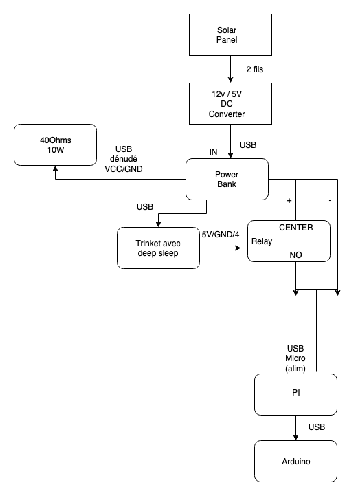

# makers' beehives - hardware




## Alimentation
- [ECO-WORTHY 25W 12V Polycrystalline Solar Panel Module Charging RV Boat](https://www.eco-worthy.com/catalog/worthy-polycrystalline-solar-panel-module-charging-boat-p-455.html)
- [UBEC DC/DC Step-Down (Buck) Converter - 5V @ 3A output](https://www.adafruit.com/product/1385)
- [Tecknet 33000mAh powerbank](http://www.tecknet.co.uk/bluetek.html)

## Raspberry Pi config

### Install Raspbian OS
1. Connect the SD card to your computer
2. Open Raspberry Pi Imager
3. Choose the last version of Raspberry Pi OS Lite and write it on SD card.

### Turn the device on
1. Plug a keyboard and a screen to the device.
2. Plug the power supply

### Configure Wifi:
Run

```
sudo nano /etc/wpa_supplicant/wpa_supplicant.conf
```

and add
```
network={
    ssid="makerslab"
    psk="makerslab"
}
```

### For an easier setup, use ssh connection
That way, you can use your own computer to edit settings and code on the device.

It is faster, you can use a decent text editor and use copy-paste.
To do so, you need to use the same wifi network.

[SSH Setup](https://medium.com/@thedyslexiccoder/how-to-remotely-access-a-raspberry-pi-on-a-mac-via-ssh-be285d418f54)

### Install dependencies
```
sudo apt update && sudo apt upgrade -y
```

#### Git
Git should already be installed.
To check it : `git`
If not :
```
sudo apt-get install git
```

#### pip
Python package manager
`sudo apt install python3-pip`

- [pySerial](http://pythonhosted.org/pyserial/shortintro.html)
- [PiCamera](https://www.raspberrypi.org/documentation/usage/camera/python/README.md)
- [imagemagick](http://makio135.tumblr.com/post/159262507202/resize-image-from-cli-with-imagemagick)
- [PyImgur](https://github.com/Damgaard/PyImgur)
- [Access a firebase DB with Python SDK](https://firebase.blog/posts/2017/07/accessing-database-from-python-admin-sdk)


#### PiCamera

`sudo pip install picamera`

#### firebase_admin

1. Parmi les dépendances de firebase admin, on trouve le paquet [**cryptography**](https://cryptography.io/en/latest/installation/), dont firebase exige une version récente *(cryptography>=3.4.0)*
2. Les dernières version de ce paquet ont besoin d’une version récente du langage Rust ****(This package requires Rust >=1.56.0.)****


```bash
curl --proto '=https' --tlsv1.2 -sSf https://sh.rustup.rs | sh
```

```
source "$HOME/.cargo/env"
```

3. Avant de lancer l’installation de firebase_admin, il faut [installer les dépendances nécessaires à l’installation de **************cryptography.**************](https://cryptography.io/en/latest/installation/#debian-ubuntu)
	a. Install dependencies for cryptography

	```
	sudo apt-get install build-essential libssl-dev libffi-dev \
		python3-dev cargo pkg-config
	```

	b. Install cryptography
	```
	pip install cryptography
	```


4. Enfin, on peut lancer l’installation de firebase_admin :

```
pip install firebase_admin
```

### Enable RaspiCam
Type ```sudo raspi-config``` and enable RaspiCam: `Interfacing Options` -> `Camera` -> `Yes`

### Clone the repository:
```cd && git clone https://github.com/emlyon/makers-beehives-hardware.git```


### Add Imgur & Firebase secret keys :

Create secret keys files within the repository:

1. `firebase-secrets.json`

https://console.firebase.google.com/project/makerslab-beehives/settings/serviceaccounts/adminsdk

2. `imgur-secrets.json`

https://imgur.com/account/settings/apps
```
{
	"imgurClientID": "xxxxxxxxxxxxxxx",
	"imgurClientSecret": "xxxxxxxxxxxxxxxxxxxxxxxxxxxxxxxxxxxxxxxx"
}
```


### Run script on Boot
Edit the `.bashrc` file, which will enable to [run a script after autologin.](https://stackoverflow.com/questions/57253379/how-to-run-foreground-script-after-autologin-to-raspbian-cli)

```nano .bashrc```

Add this line at the bottom of the file :

```python makers-beehives-hardware/beehives.py```

### References
- [Raspberry Pi / Python: install pip for Python modules dependencies installation](http://makio135.tumblr.com/post/84826991967/raspberry-pi-python-install-pip-for-python)
- [How to mount a USB flash drive on Raspberry Pi](http://raspi.tv/2012/mount-a-usb-flash-drive-on-raspberry-pi)
- [How to setup multiple WiFi networks?](http://raspberrypi.stackexchange.com/questions/11631/how-to-setup-multiple-wifi-networks#11738)
- [imagemagick/mogrify](https://www.imagemagick.org/script/mogrify.php)
- [Camera Module](https://www.raspberrypi.org/documentation/hardware/camera/README.md)
- [Scheduling tasks with Cron](https://www.raspberrypi.org/documentation/linux/usage/cron.md)
- [Change default username](http://raspberrypi.stackexchange.com/questions/12827/change-default-username)
- [Execute sudo without Password](http://askubuntu.com/questions/147241/execute-sudo-without-password#147265)


## Arduino config

### Load sensors

Based on https://www.instructables.com/id/Arduino-Bathroom-Scale-With-50-Kg-Load-Cells-and-H/

### Seed Studio Base Shield wiring

- [Base Shield Grove](https://www.ebay.fr/itm/Shield-base-GROVE-pou-Arduino-compatible-Arduino-SEESHIEV2-/282741493252)
- [Temperature & Humidity Sensor](https://www.seeedstudio.com/Grove-Temperature-Humidity-Sensor-DHT11-p-745.html) on D2
	- libraries: https://github.com/adafruit/Adafruit_Sensor & https://github.com/adafruit/DHT-sensor-library
	- code: http://wiki.seeedstudio.com/Grove-TemperatureAndHumidity_Sensor/ & https://www.instructables.com/id/Arduino-DHT11-Sensor/
- [Grove Sound Sensor](https://www.seeedstudio.com/Grove-Sound-Sensor-p-752.html) on A0
	- code: http://wiki.seeedstudio.com/Grove-Sound_Sensor/
- [Digital Light Sensor](https://www.seeedstudio.com/Grove-Digital-Light-Sensor-p-1281.html) on I2C
	- library: http://wiki.seeedstudio.com/Grove-Digital_Light_Sensor/: Digital Light Sensor Library
	- code: http://wiki.seeedstudio.com/Grove-Digital_Light_Sensor/ & http://www.ardumotive.com/lux-sensor-en.html
- [Multichannel Gas Sensor](https://www.seeedstudio.com/Grove-Multichannel-Gas-Sensor-p-2502.html) on I2C
	- library: https://github.com/Seeed-Studio/Mutichannel_Gas_Sensor/archive/master.zip
	- code: http://wiki.seeedstudio.com/Grove-Multichannel_Gas_Sensor/
