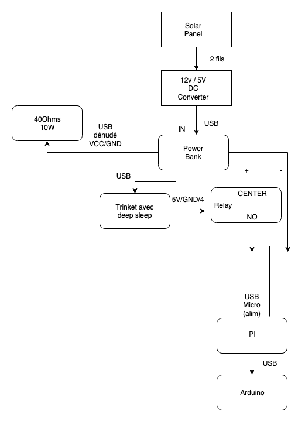
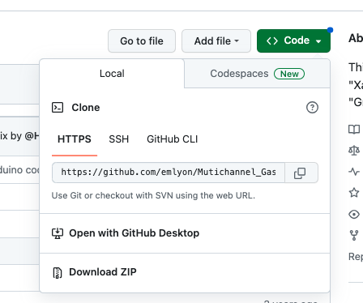

# makers' beehives - hardware
This beehive project is dedicated to remotely monitoring a beehive's activity :

Several sensors collect data. This data is then sent through WiFi to a database, and made accessible on a website.

In this repository, we will focus on collecting and sending the data.

The [data visualisation on the website is dealt with on another repository](https://github.com/emlyon/makers-beehives-website/)
## Summary :
[1. Global setup](https://github.com/emlyon/makers-beehives-hardware#global-setup)

[2. Power supply](https://github.com/emlyon/makers-beehives-hardware#power-supply)

[3. Raspberry Pi setup](https://github.com/emlyon/makers-beehives-hardware#raspberry-pi-setup)

[4. Arduino Uno setup](https://github.com/emlyon/makers-beehives-hardware#arduino-setup)

[5. Arduino Trinket setup]

## 1. Global setup

[Edition du diagramme (drive makers lab)](https://drive.google.com/drive/folders/1L2eGuwuu4EVNqN6som_GeDfP7-7ZTObA)


This system is designed to run periodic measurement cycles and send the results online.

For each cycle, we will:
- produce and upload a gif from pictures from the beehive's entrance
- read several parameters about the beehive's environment and conditions :
	- Temperature
	- Humidity
	- Noise
	- Weight
	- Light
	- CO
	- NO2

All of this data will then be stored on a online database.

For this project, we use :
- a solar panel and a powerbank for power supply.
- an Arduino Trinket, which will trigger and power on the system for 10 minutes, once an hour.
- an Arduino Uno and a series of sensors. The Arduino Uno will read data from its sensors and send them when requested through a serial port.
- a Raspberry Pi which will read data from the Arduino Uno, take pictures from a camera, transform them into a gif, and then upload all the data online.


## 2. Power supply

To power the system, we use a solar panel and a powerbank.

- [ECO-WORTHY 25W 12V Polycrystalline Solar Panel Module Charging RV Boat](https://www.eco-worthy.com/catalog/worthy-polycrystalline-solar-panel-module-charging-boat-p-455.html)
- [UBEC DC/DC Step-Down (Buck) Converter - 5V @ 3A output](https://www.adafruit.com/product/1385)
- [Tecknet 33000mAh powerbank](http://www.tecknet.co.uk/bluetek.html)

## 3. Raspberry Pi setup

### Install Raspbian OS
1. Connect the SD card to your computer
2. Open Raspberry Pi Imager
3. Choose the last version of Raspberry Pi OS Lite and write it on SD card.

### Turn the device on
1. Insert the micro SD into the Raspberry Pi
2. Plug a keyboard and a screen to the device.
3. Plug the power supply : the device should boot now !
4. Follow the prompts :
	- Keyboard configuration
	- username : choose 'beeN', with N being the number of your beehive. This will be used to track the beehive's data.

You might notice some intermittent warnings : "Undervoltage detected!".
In that case :
- check that you are using a 3A power supply.
- check that there is no bad contact on the board
If everything else keeps working, you can ignore them.


### Configure Wifi:
Run

```
sudo nano /etc/wpa_supplicant/wpa_supplicant.conf
```

and add
```
ctrl_interface=DIR=/var/run/wpa_supplicant GROUP=netdev
update_config=1
network={
    ssid="makerslab"
    psk="makerslab"
}
```

Where `ssid` and `psk` are the Wi-Fi network's name and password.

If you see the following message, you need some extra config to enable Wi-fi connection

> Wi-Fi is currently blocked by rfkill.

--> [Use raspi-config to set the country before use.](https://raspberrypi.stackexchange.com/questions/123717/how-to-disable-wi-fi-is-currently-blocked-by-rfkill-message)


### For an easier setup, use ssh connection
That way, you can use your own computer to edit settings and code on the device.

It is faster, you can use a decent text editor and use copy-paste.
To do so, you need to use the same wifi network.

[SSH Setup - full process](https://medium.com/@thedyslexiccoder/how-to-remotely-access-a-raspberry-pi-on-a-mac-via-ssh-be285d418f54)

```
sudo raspi-config
```
1. Interface Options
2. I2 SSH > Enable SSH

Get the hostname :

```
hostname -I
```

The output should look like this :
> 172.XX.XX.XX


Then you should be able to connect from your computer :

```
ssh beeN@172.XX.XX.XX
```

### Install dependencies
```
sudo apt update && sudo apt upgrade -y
```

#### Git
Git should already be installed.
To check it : `git`
If not :
```
sudo apt-get install git
```

#### pip
Python package manager

```
sudo apt install python3-pip
```

#### PySerial

Enables serial communication on Pi.

[pySerial](http://pythonhosted.org/pyserial/shortintro.html)


#### PiCamera

[Picamera - Doc](https://www.raspberrypi.org/documentation/usage/camera/python/README.md)

```
sudo pip install picamera
```

#### imageMagick

Enables image manipulation.

[Resize image from CLI with imagemagick](http://makio135.tumblr.com/post/159262507202/resize-image-from-cli-with-imagemagick)
[Doc - imageMagick CLI](https://imagemagick.org/script/command-line-processing.php)

```
sudo apt-get install imagemagick
```

#### PyImgur

Enables the upload of pictures (and gifs) on Imgur.

[PyImgur - Doc](https://github.com/Damgaard/PyImgur)

```
pip install pyimgur
```

#### firebase_admin

[Access a firebase DB with Python SDK](https://firebase.blog/posts/2017/07/accessing-database-from-python-admin-sdk)

1. Parmi les dépendances de firebase admin, on trouve le paquet [**cryptography**](https://cryptography.io/en/latest/installation/), dont firebase exige une version récente *(cryptography>=3.4.0)*
2. Les dernières version de ce paquet ont besoin d’une version récente du langage Rust ****(This package requires Rust >=1.56.0.)****


```bash
curl --proto '=https' --tlsv1.2 -sSf https://sh.rustup.rs | sh
```

```
source "$HOME/.cargo/env"
```

3. Avant de lancer l’installation de firebase_admin, il faut [installer les dépendances nécessaires à l’installation de **************cryptography.**************](https://cryptography.io/en/latest/installation/#debian-ubuntu)
	a. Install dependencies for cryptography

	```
	sudo apt-get install build-essential libssl-dev libffi-dev \
		python3-dev cargo pkg-config
	```

	b. Install cryptography
	```
	pip install cryptography
	```

	This step will probably last quite a long time, while prompting the following information :

> Building wheel for cryptography (PEP 517) ... |


4. Enfin, on peut lancer l’installation de firebase_admin :

```
pip install firebase_admin
```

### Enable RaspiCam
Type ```sudo raspi-config``` and enable RaspiCam: `Interfacing Options` -> `Camera` -> `Yes`

### Clone the repository:
```cd && git clone https://github.com/emlyon/makers-beehives-hardware.git```


### Add Imgur & Firebase secret keys :

Create secret keys files within the repository:

To move within the repository, type

```
cd makers-beehives-hardware/
```

1. `firebase-secrets.json`

```
touch firebase-secrets.json
nano firebase-secrets.json
```

https://console.firebase.google.com/project/makerslab-beehives/settings/serviceaccounts/adminsdk

2. `imgur-secrets.json`

```
touch imgur-secrets.json
nano imgur-secrets.json
```

https://imgur.com/account/settings/apps
```
{
	"imgurClientID": "xxxxxxxxxxxxxxx",
	"imgurClientSecret": "xxxxxxxxxxxxxxxxxxxxxxxxxxxxxxxxxxxxxxxx"
}
```


### Run script on Boot
Edit the `.bashrc` file, which will enable to [run a script after autologin.](https://stackoverflow.com/questions/57253379/how-to-run-foreground-script-after-autologin-to-raspbian-cli)

```
nano ~/.bashrc
```

Add this line at the bottom of the file :

```python makers-beehives-hardware/beehives.py```

### References

**Legacy references :**

- [Raspberry Pi / Python: install pip for Python modules dependencies installation](http://makio135.tumblr.com/post/84826991967/raspberry-pi-python-install-pip-for-python)
- [How to mount a USB flash drive on Raspberry Pi](http://raspi.tv/2012/mount-a-usb-flash-drive-on-raspberry-pi)
- [How to setup multiple WiFi networks?](http://raspberrypi.stackexchange.com/questions/11631/how-to-setup-multiple-wifi-networks#11738)
- [imagemagick/mogrify](https://www.imagemagick.org/script/mogrify.php)
- [Camera Module](https://www.raspberrypi.org/documentation/hardware/camera/README.md)
- [Scheduling tasks with Cron](https://www.raspberrypi.org/documentation/linux/usage/cron.md)
- [Change default username](http://raspberrypi.stackexchange.com/questions/12827/change-default-username)
- [Execute sudo without Password](http://askubuntu.com/questions/147241/execute-sudo-without-password#147265)


## 4. Arduino Uno setup

1. Open Arduino IDE
2. Install Adafruit's board manager (if not already installed) : [Adafruit Arduino AVR Boards](https://learn.adafruit.com/add-boards-arduino-v164/setup)
3. Plug in the Arduino Uno board
4. Paste the [code from arduino_beehive.ino](https://github.com/emlyon/makers-beehives-hardware/blob/master/arduino_beehive/arduino_beehive.ino) into the IDE window
5. Install required libraries from the library interface :
	- [Dictionary](https://www.arduino.cc/reference/en/libraries/dictionary/)
6. Download and install the sensors' custom libraries

	For the project's needs, we had to customize some existing libraries :
	- [Multichannel Gas Sensor](https://github.com/emlyon/Mutichannel_Gas_Sensor)
	- [Grove_Digital_Light_Sensor](https://github.com/makerslabemlyon/Grove_Digital_Light_Sensor)
	- [Grove_Temperature_And_Humidity_Sensor](https://github.com/makerslabemlyon/Grove_Temperature_And_Humidity_Sensor)
	- [HX711](https://github.com/makerslabemlyon/HX711)

	For each of the following :
	1. access to the github repository
	2. click on *Code*, and *Downlod ZIP*
		
	3. Install the library into Arduino IDE:

		Click on *Sketch* > *Include library* > *Add .ZIP library*, then choose the downloaded .ZIP library.
	4. Upload the code to the Arduino Uno board.

		If you access the serial monitor, you should see some information about the sensors, which will depend on whether the sensors are plugged or not.


Now, you can wire up the sensors on your board, following our documentation on Notion:
- [Plug the sensors](https://www.notion.so/makerslabemlyon/Documentation-Ruches-2023-87b9968f1ae540bebe24491d58c0829e?pvs=4#df472eb7cfa948afa646c095382271f2)
- [Plug the load sensor](https://www.notion.so/makerslabemlyon/Documentation-Ruches-2023-87b9968f1ae540bebe24491d58c0829e?pvs=4#83c36c557b3c4b8399e7c495dc986f85)


Then, you should be able to fetch data from the sensors :

From the serial monitor, you can request data from the sensors by sending the following serial message : `DATA?`

### Load sensors

Based on https://www.instructables.com/id/Arduino-Bathroom-Scale-With-50-Kg-Load-Cells-and-H/

### Seed Studio Base Shield wiring

- [Base Shield Grove](https://www.ebay.fr/itm/Shield-base-GROVE-pou-Arduino-compatible-Arduino-SEESHIEV2-/282741493252)
- [Temperature & Humidity Sensor](https://www.seeedstudio.com/Grove-Temperature-Humidity-Sensor-DHT11-p-745.html) on D2
	- libraries: https://github.com/adafruit/Adafruit_Sensor & https://github.com/adafruit/DHT-sensor-library
	- code: http://wiki.seeedstudio.com/Grove-TemperatureAndHumidity_Sensor/ & https://www.instructables.com/id/Arduino-DHT11-Sensor/
- [Grove Sound Sensor](https://www.seeedstudio.com/Grove-Sound-Sensor-p-752.html) on A0
	- code: http://wiki.seeedstudio.com/Grove-Sound_Sensor/
- [Digital Light Sensor](https://www.seeedstudio.com/Grove-Digital-Light-Sensor-p-1281.html) on I2C
	- library: http://wiki.seeedstudio.com/Grove-Digital_Light_Sensor/: Digital Light Sensor Library
	- code: http://wiki.seeedstudio.com/Grove-Digital_Light_Sensor/ & http://www.ardumotive.com/lux-sensor-en.html
- [Multichannel Gas Sensor](https://www.seeedstudio.com/Grove-Multichannel-Gas-Sensor-p-2502.html) on I2C
	- library: https://github.com/Seeed-Studio/Mutichannel_Gas_Sensor/archive/master.zip
	- code: http://wiki.seeedstudio.com/Grove-Multichannel_Gas_Sensor/

## 5. Arduino Trinket setup

The Arduino Trinket will control a relay, in order to power the system on for 10 minutes once an hour.

We will follow [this documentation](https://learn.adafruit.com/introducing-pro-trinket/setting-up-arduino-ide) to set up the trinket

1. Open Arduino IDE
2. Install Adafruit's board manager (if not already installed) : [Adafruit Arduino AVR Boards](https://learn.adafruit.com/add-boards-arduino-v164/setup)
3. Select the Pro Trinket 5V/16MHz (USB) board :

	*Tools* > *Board* > *Adafruit AVR Boards* > *Pro Trinket 5V/16MHz*
4. Next select the USBtinyISP programmer : *Tools* > *Programmer* > *USBtinyISP*
5. Paste the code from [trinketRelay.ino file](https://github.com/emlyon/makers-beehives-hardware/blob/master/trinketRelay/trinketRelay.ino) into the IDE window
6. Plug in the Arduino Trinket, make sure you see the green LED lit (power good) and the red LED pulsing. Press the button if the red LED is not pulsing, to get into bootloader mode.
7. Upload the code to the board : *Sketch* > *Upload using programmer*